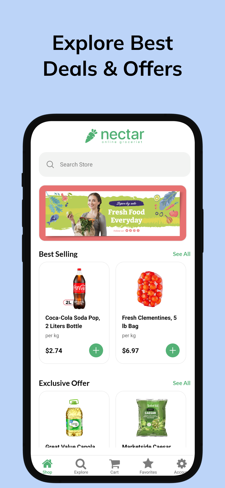

# Nectar - Grocery Shopping App

Welcome to the documentation for **Nectar**, a grocery shopping mobile application built with React Native and Expo. Nectar allows users to browse and purchase groceries seamlessly. This project consists of the mobile app (React Native Expo) and a backend server.

## Watch our Video Demo

[](https://www.youtube.com/watch?v=sNSF_BiEfO8)

## Features

### Mobile App:

1. **User Authentication**:
   - Secure login and signup functionality (Firebase).
   - Google login integration.

2. **User-Friendly Interface**:
   - An intuitive and modern interface tailored for grocery shopping.

3. **Payment System**:
   - Integrated with **Stripe** for secure payment processing.

4. **Navigation**:
   - Smooth navigation powered by **Expo Router**.

5. **backend Integration**:
   - Connected to a Node.js/Express backend for data management.

### Backend Server

1. **API Support**:
   - Handles product data, orders, and user management.

2. **Database**:
   - Uses MongoDB for robust data storage.

## Getting Started

To use the Nectar app, follow these steps:

1. **Clone the Repository**:
   ```bash
   git clone <repository_url>
   ```

2. **Install Dependencies**:
   Navigate to the `grocery` directory and run:
   ```bash
   npm install
   ```

3. **Start the App**:
   ```bash
   npx expo start
   ```

4. **Run on Device**: Use the Expo Go app to scan the QR code.

## Screenshots

<div>



</div>

## Questions and Support

If you have any questions, encounter issues, or need assistance, please feel free to reach out to us.

**Project Team:**
- Md Tasluf Morshed
- tasluf665@gmail.com